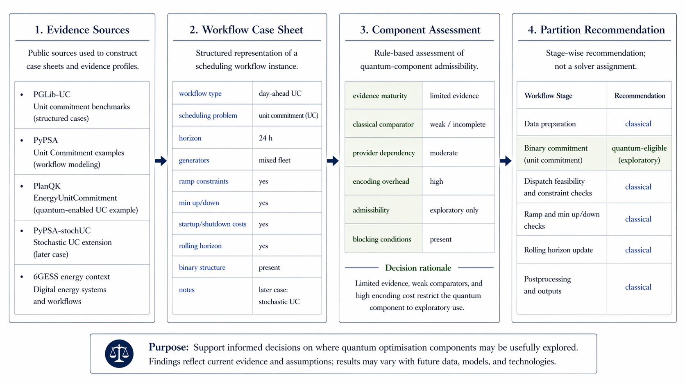
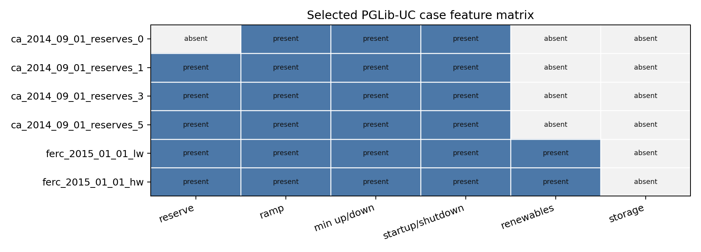

# Assessment-Guided Partition for Hybrid Quantum-Classical Scheduling Workflows

## Problem

Digital energy scheduling workflows such as unit commitment may include candidate quantum-enabled optimisation components. The practical question is not whether quantum optimisation is promising in general. The practical question is whether a quantum component is admissible for a workflow and, if so, which stages should remain classical and which may be quantum. The working question is: "Given a scheduling workflow and a candidate quantum-enabled optimisation component, is the component admissible, and where could it be placed in the workflow?"

## What this repo does

- builds small case sheets from public unit commitment sources,
- represents candidate quantum components as evidence profiles,
- applies conservative assessment rules,
- outputs a recommended hybrid partition and blocking rationale,
- extracts simple workflow features from selected PGLib-UC cases.

The workflow figure below shows the intended reading order of the artifact: source grounding, case-sheet construction, component assessment, and stage-wise partition recommendation.

<p align="center">
  
</p>

## Data/source grounding

- PGLib-UC: https://github.com/power-grid-lib/pglib-uc
- PyPSA Unit Commitment example: https://docs.pypsa.org/latest/examples/unit-commitment/
- PlanQK EnergyUnitCommitment: https://github.com/PlanQK/EnergyUnitCommitment
- PyPSA-stochUC as a later representative case: https://github.com/PPGS-Tools/PyPSA-stochUC
- 6GESS energy-systems context: https://www.6gflagship.com/6gess/

## Quick demo

```bash
python scripts/run_partition_demo.py
```

Expected output:
- `outputs/demo/partition_report.json`
- `outputs/demo/partition_report.md`

## Case-feature extraction

```bash
python scripts/build_case_features.py
```

Expected:
- `outputs/case_features/pglib_uc_case_features.csv`
- `outputs/case_features/fig_case_feature_matrix.png`

The matrix summarises case structure across the selected PGLib-UC benchmark set. Rows are selected cases, columns are workflow-relevant features, and each cell records whether that feature is present, absent, or unknown for the case. Ramp limits, minimum up/down constraints, and startup/shutdown costs are present throughout; reserve requirements vary across the California cases, and renewables appear in the FERC cases. That variation is the point: case sheets capture the workflow structure before admissibility and partition decisions are made.

<p align="center">
  
</p>

One concrete reading is straightforward. `ca_2014_09_01_reserves_0` and `ca_2014_09_01_reserves_1` share the same commitment core, but reserve handling changes from absent to present. `ferc_2015_01_01_lw` and `ferc_2015_01_01_hw` add renewables on top of the same core structure. The assessment question then becomes narrower and more concrete: whether a candidate quantum-enabled component belongs only in the binary commitment stage while dispatch, feasibility, and workflow control remain classical.

## Current status

Small research seed. Conservative rule-based partition advisor. Includes selected PGLib-UC case-feature extraction and a feature-matrix figure. Output is assessment guidance for workflow partition decisions.
