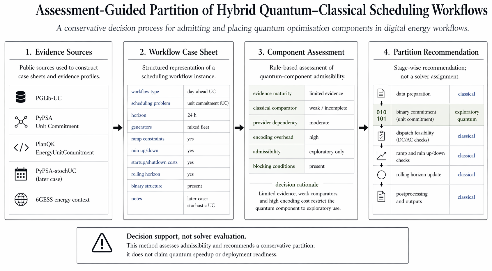

# Assessment-Guided Partition for Hybrid Quantum-Classical Scheduling Workflows

Assessment-guided partition for hybrid quantum-classical scheduling workflows.



## Problem

Digital energy scheduling workflows such as unit commitment may include candidate quantum-enabled optimisation components. The practical question is not whether quantum optimisation is promising in general. The practical question is whether a quantum component is admissible for a workflow and, if so, which stages should remain classical and which may be quantum. This repo asks: "Given a scheduling workflow and a candidate quantum-enabled optimisation component, is the component admissible, and where could it be placed in the workflow?"

## What this repo does

This repo:
- builds small case sheets from public unit commitment sources,
- represents candidate quantum components as evidence profiles,
- applies simple assessment rules,
- outputs a recommended hybrid partition and blocking rationale.

## What this repo does not do

- does not solve unit commitment,
- does not run QAOA,
- does not validate deployment,
- does not claim quantum advantage,
- does not replace energy-system simulators,
- does not implement a scheduler/runtime.

This repo does not solve energy optimisation problems. It does not run quantum algorithms. It does not claim quantum advantage.

## Data/source grounding

The prototype is grounded in the following public sources:

- PGLib-UC: https://github.com/power-grid-lib/pglib-uc
- PyPSA Unit Commitment example: https://docs.pypsa.org/latest/examples/unit-commitment/
- PlanQK EnergyUnitCommitment: https://github.com/PlanQK/EnergyUnitCommitment
- PyPSA-stochUC: https://github.com/PPGS-Tools/PyPSA-stochUC
- 6GESS: https://www.6gflagship.com/6gess/

The repository records the role and limits of each source in [data_sources/sources.yaml](/Users/mac/Documents/GitHub/HQC-PARTITION/data_sources/sources.yaml).

## Quick demo

```bash
python scripts/run_partition_demo.py
```

Expected output:
- `outputs/demo/partition_report.json`
- `outputs/demo/partition_report.md`
